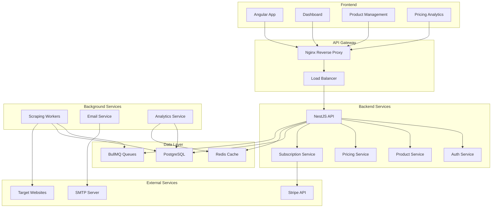
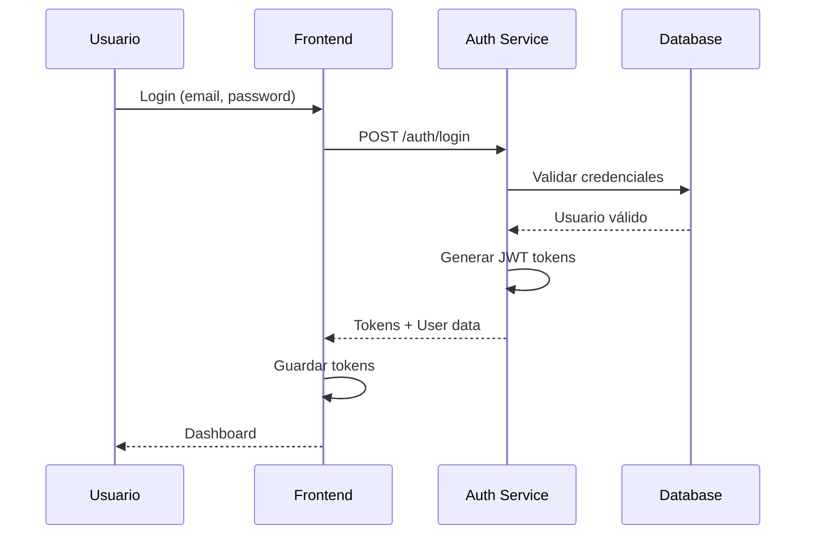
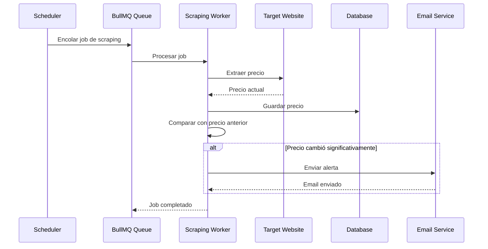
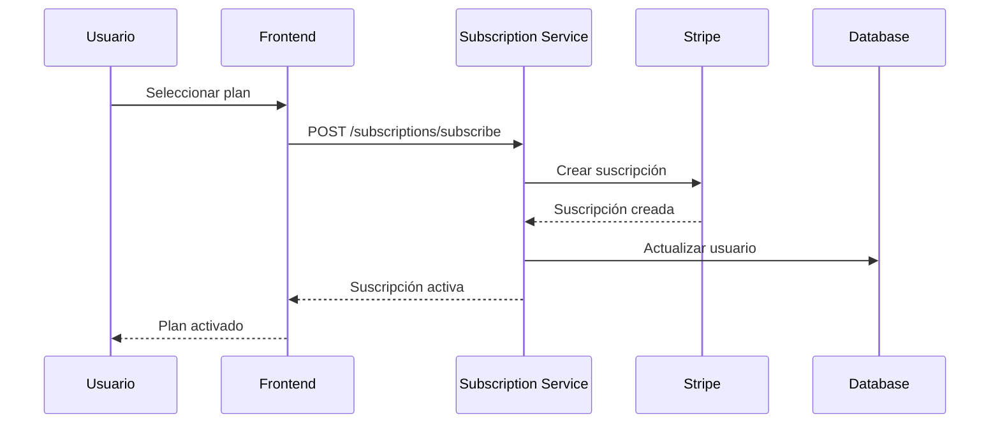

# PriceSnap - Arquitectura del Sistema

## 📋 Índice

- [Visión General](#visión-general)
- [Arquitectura de Alto Nivel](#arquitectura-de-alto-nivel)
- [Componentes del Sistema](#componentes-del-sistema)
- [Flujo de Datos](#flujo-de-datos)
- [Base de Datos](#base-de-datos)
- [Sistema de Scraping](#sistema-de-scraping)
- [Seguridad](#seguridad)
- [Escalabilidad](#escalabilidad)
- [Monitoreo](#monitoreo)

---

## 🎯 Visión General

PriceSnap es una aplicación SaaS de análisis de precios de competencia diseñada para Pymes de e-commerce. La arquitectura está basada en microservicios con un enfoque en escalabilidad, confiabilidad y mantenibilidad.

### Principios Arquitectónicos

- **Modularidad**: Cada funcionalidad está encapsulada en módulos independientes
- **Escalabilidad**: Diseño horizontal para manejar crecimiento de usuarios
- **Confiabilidad**: Sistema de colas y reintentos para operaciones críticas
- **Mantenibilidad**: Código limpio y bien documentado
- **Seguridad**: Autenticación robusta y validación de datos

---

## 🏗️ Arquitectura de Alto Nivel



---

## 🔧 Componentes del Sistema

### 1. Frontend (Angular)

**Responsabilidades:**
- Interfaz de usuario para gestión de productos
- Dashboard de análisis de precios
- Configuración de competidores
- Gestión de suscripciones

**Tecnologías:**
- Angular 17+
- Angular Material
- RxJS para manejo de estado
- Chart.js para visualizaciones

### 2. API Gateway (Nginx)

**Responsabilidades:**
- Balanceador de carga
- Terminación SSL
- Rate limiting
- Compresión de respuestas

**Configuración:**
```nginx
upstream api_backend {
    server api1:3000;
    server api2:3000;
}

server {
    listen 80;
    server_name api.pricesnap.com;
    
    location / {
        proxy_pass http://api_backend;
        proxy_set_header Host $host;
        proxy_set_header X-Real-IP $remote_addr;
    }
}
```

### 3. Backend Services (NestJS)

#### 3.1 Auth Service
```typescript
@Module({
  imports: [
    JwtModule.register({
      secret: process.env.JWT_SECRET,
      signOptions: { expiresIn: '7d' },
    }),
  ],
  providers: [AuthService, JwtStrategy],
  controllers: [AuthController],
})
export class AuthModule {}
```

**Responsabilidades:**
- Registro y autenticación de usuarios
- Gestión de tokens JWT
- Validación de permisos
- Refresh tokens

#### 3.2 Product Service
```typescript
@Module({
  imports: [TypeOrmModule.forFeature([Product, Competitor])],
  providers: [ProductService, CompetitorService],
  controllers: [ProductController, CompetitorController],
})
export class ProductModule {}
```

**Responsabilidades:**
- CRUD de productos
- Gestión de competidores
- Validación de límites por plan
- Metadatos de productos

#### 3.3 Pricing Service
```typescript
@Module({
  imports: [BullModule.registerQueue({ name: 'scraping' })],
  providers: [PricingService, ScrapingProcessor],
  controllers: [PricingController],
})
export class PricingModule {}
```

**Responsabilidades:**
- Historial de precios
- Análisis de tendencias
- Alertas de cambios de precio
- Comparación de competidores

#### 3.4 Subscription Service
```typescript
@Module({
  providers: [SubscriptionService, StripeService],
  controllers: [SubscriptionController],
})
export class SubscriptionModule {}
```

**Responsabilidades:**
- Gestión de planes de suscripción
- Integración con Stripe
- Facturación automática
- Límites de uso

### 4. Background Services

#### 4.1 Scraping Workers
```typescript
@Processor('scraping')
export class ScrapingProcessor {
  @Process('scrape-price')
  async scrapePrice(job: Job<ScrapingJobData>) {
    const { url, selectors } = job.data;
    
    const browser = await playwright.chromium.launch();
    const page = await browser.newPage();
    
    await page.goto(url);
    const price = await page.textContent(selectors.price);
    
    await browser.close();
    return { price, timestamp: new Date() };
  }
}
```

**Responsabilidades:**
- Extracción de precios de sitios web
- Manejo de anti-bot detection
- Rotación de proxies
- Cache inteligente

#### 4.2 Email Service
```typescript
@Injectable()
export class EmailService {
  async sendPriceAlert(user: User, alert: PriceAlert) {
    const template = await this.getTemplate('price-alert');
    await this.mailerService.sendMail({
      to: user.email,
      subject: 'Alerta de Precio - PriceSnap',
      template: template,
      context: { alert, user }
    });
  }
}
```

**Responsabilidades:**
- Envío de alertas por email
- Templates de email
- Notificaciones de sistema
- Confirmaciones de suscripción

---

## 🔄 Flujo de Datos

### 1. Flujo de Autenticación



### 2. Flujo de Scraping



### 3. Flujo de Suscripción



---

## 🗄️ Base de Datos

### Esquema Principal

```sql
-- Usuarios
CREATE TABLE users (
    id UUID PRIMARY KEY DEFAULT gen_random_uuid(),
    email VARCHAR(255) UNIQUE NOT NULL,
    password_hash VARCHAR(255) NOT NULL,
    name VARCHAR(255) NOT NULL,
    company VARCHAR(255),
    subscription_plan VARCHAR(50) DEFAULT 'starter',
    subscription_status VARCHAR(50) DEFAULT 'active',
    stripe_customer_id VARCHAR(255),
    created_at TIMESTAMP DEFAULT NOW(),
    updated_at TIMESTAMP DEFAULT NOW()
);

-- Productos
CREATE TABLE products (
    id UUID PRIMARY KEY DEFAULT gen_random_uuid(),
    user_id UUID REFERENCES users(id) ON DELETE CASCADE,
    name VARCHAR(255) NOT NULL,
    url VARCHAR(500) NOT NULL,
    sku VARCHAR(100),
    ean VARCHAR(50),
    current_price DECIMAL(10,2),
    last_scraped TIMESTAMP,
    created_at TIMESTAMP DEFAULT NOW(),
    updated_at TIMESTAMP DEFAULT NOW()
);

-- Competidores
CREATE TABLE competitors (
    id UUID PRIMARY KEY DEFAULT gen_random_uuid(),
    product_id UUID REFERENCES products(id) ON DELETE CASCADE,
    name VARCHAR(255) NOT NULL,
    url VARCHAR(500) NOT NULL,
    current_price DECIMAL(10,2),
    last_scraped TIMESTAMP,
    status VARCHAR(50) DEFAULT 'active',
    created_at TIMESTAMP DEFAULT NOW(),
    updated_at TIMESTAMP DEFAULT NOW()
);

-- Historial de precios
CREATE TABLE price_history (
    id UUID PRIMARY KEY DEFAULT gen_random_uuid(),
    competitor_id UUID REFERENCES competitors(id) ON DELETE CASCADE,
    price DECIMAL(10,2) NOT NULL,
    scraped_at TIMESTAMP DEFAULT NOW(),
    url VARCHAR(500),
    status VARCHAR(50) DEFAULT 'success'
);

-- Suscripciones
CREATE TABLE subscriptions (
    id UUID PRIMARY KEY DEFAULT gen_random_uuid(),
    user_id UUID REFERENCES users(id) ON DELETE CASCADE,
    stripe_subscription_id VARCHAR(255) UNIQUE,
    plan_id VARCHAR(50) NOT NULL,
    status VARCHAR(50) NOT NULL,
    current_period_start TIMESTAMP,
    current_period_end TIMESTAMP,
    cancel_at_period_end BOOLEAN DEFAULT FALSE,
    created_at TIMESTAMP DEFAULT NOW(),
    updated_at TIMESTAMP DEFAULT NOW()
);

-- Trabajos de scraping
CREATE TABLE scraping_jobs (
    id UUID PRIMARY KEY DEFAULT gen_random_uuid(),
    competitor_id UUID REFERENCES competitors(id) ON DELETE CASCADE,
    status VARCHAR(50) NOT NULL,
    result JSONB,
    error_message TEXT,
    created_at TIMESTAMP DEFAULT NOW(),
    completed_at TIMESTAMP
);
```

### Índices para Performance

```sql
-- Índices para consultas frecuentes
CREATE INDEX idx_products_user_id ON products(user_id);
CREATE INDEX idx_competitors_product_id ON competitors(product_id);
CREATE INDEX idx_price_history_competitor_id ON price_history(competitor_id);
CREATE INDEX idx_price_history_scraped_at ON price_history(scraped_at);
CREATE INDEX idx_scraping_jobs_status ON scraping_jobs(status);
CREATE INDEX idx_scraping_jobs_created_at ON scraping_jobs(created_at);

-- Índices compuestos
CREATE INDEX idx_price_history_competitor_scraped ON price_history(competitor_id, scraped_at);
CREATE INDEX idx_products_user_created ON products(user_id, created_at);
```

---

## 🕷️ Sistema de Scraping

### Arquitectura de Workers

```typescript
// Configuración de colas
@Module({
  imports: [
    BullModule.forRoot({
      redis: {
        host: process.env.REDIS_HOST,
        port: process.env.REDIS_PORT,
      },
    }),
    BullModule.registerQueue(
      { name: 'scraping' },
      { name: 'email' },
      { name: 'analytics' }
    ),
  ],
})
export class QueueModule {}
```

### Estrategias Anti-Bot

```typescript
export class AntiBotService {
  async setupPage(page: Page): Promise<void> {
    // User agent realista
    await page.setUserAgent(this.getRandomUserAgent());
    
    // Headers realistas
    await page.setExtraHTTPHeaders({
      'Accept-Language': 'es-ES,es;q=0.9,en;q=0.8',
      'Accept': 'text/html,application/xhtml+xml,application/xml;q=0.9,*/*;q=0.8',
    });
    
    // Delays aleatorios
    await page.waitForTimeout(this.getRandomDelay());
    
    // Simulación de scroll
    await page.evaluate(() => {
      window.scrollTo(0, Math.random() * 1000);
    });
  }
  
  private getRandomUserAgent(): string {
    const userAgents = [
      'Mozilla/5.0 (Macintosh; Intel Mac OS X 10_15_7) AppleWebKit/537.36',
      'Mozilla/5.0 (Windows NT 10.0; Win64; x64) AppleWebKit/537.36',
      'Mozilla/5.0 (X11; Linux x86_64) AppleWebKit/537.36'
    ];
    return userAgents[Math.floor(Math.random() * userAgents.length)];
  }
}
```

### Sistema de Cache

```typescript
@Injectable()
export class CacheService {
  constructor(
    @InjectRedis() private redis: Redis,
  ) {}
  
  async getPrice(competitorId: string): Promise<number | null> {
    const cached = await this.redis.get(`price:${competitorId}`);
    return cached ? parseFloat(cached) : null;
  }
  
  async setPrice(competitorId: string, price: number, ttl: number = 3600): Promise<void> {
    await this.redis.setex(`price:${competitorId}`, ttl, price.toString());
  }
  
  async invalidatePrice(competitorId: string): Promise<void> {
    await this.redis.del(`price:${competitorId}`);
  }
}
```

---

## 🔒 Seguridad

### Autenticación JWT

```typescript
@Injectable()
export class JwtStrategy extends PassportStrategy(Strategy) {
  constructor(
    private usersService: UsersService,
  ) {
    super({
      jwtFromRequest: ExtractJwt.fromAuthHeaderAsBearerToken(),
      ignoreExpiration: false,
      secretOrKey: process.env.JWT_SECRET,
    });
  }
  
  async validate(payload: any) {
    const user = await this.usersService.findById(payload.sub);
    if (!user) {
      throw new UnauthorizedException();
    }
    return user;
  }
}
```

### Validación de Datos

```typescript
export class CreateProductDto {
  @IsString()
  @IsNotEmpty()
  @Length(1, 255)
  name: string;
  
  @IsUrl()
  @IsNotEmpty()
  url: string;
  
  @IsOptional()
  @IsString()
  @Length(1, 100)
  sku?: string;
  
  @IsOptional()
  @IsString()
  @Length(13, 13)
  ean?: string;
}
```

### Rate Limiting

```typescript
@Injectable()
export class RateLimitGuard implements CanActivate {
  constructor(
    @InjectRedis() private redis: Redis,
  ) {}
  
  async canActivate(context: ExecutionContext): Promise<boolean> {
    const request = context.switchToHttp().getRequest();
    const key = `rate_limit:${request.ip}`;
    
    const current = await this.redis.incr(key);
    if (current === 1) {
      await this.redis.expire(key, 60); // 1 minuto
    }
    
    return current <= 100; // 100 requests por minuto
  }
}
```

---

## 📈 Escalabilidad

### Horizontal Scaling

```yaml
# docker-compose.scale.yml
version: '3.8'
services:
  api:
    image: pricesnap-api
    deploy:
      replicas: 3
    environment:
      - NODE_ENV=production
    networks:
      - pricesnap-network
  
  scraping-worker:
    image: pricesnap-api
    command: yarn run start:worker
    deploy:
      replicas: 5
    environment:
      - NODE_ENV=production
    networks:
      - pricesnap-network
```

### Load Balancing

```nginx
upstream api_backend {
    least_conn;
    server api1:3000 weight=3;
    server api2:3000 weight=3;
    server api3:3000 weight=2;
}

upstream worker_backend {
    server worker1:3000;
    server worker2:3000;
    server worker3:3000;
    server worker4:3000;
    server worker5:3000;
}
```

### Database Sharding

```typescript
@Injectable()
export class DatabaseService {
  constructor(
    @InjectRepository(User, 'shard1') private userRepo1: Repository<User>,
    @InjectRepository(User, 'shard2') private userRepo2: Repository<User>,
  ) {}
  
  getUserRepository(userId: string): Repository<User> {
    // Sharding por hash del user ID
    const shard = this.getShard(userId);
    return shard === 1 ? this.userRepo1 : this.userRepo2;
  }
  
  private getShard(userId: string): number {
    const hash = this.hash(userId);
    return hash % 2 + 1;
  }
}
```

---

## 📊 Monitoreo

### Logging Estructurado

```typescript
@Injectable()
export class LoggerService {
  private logger = new Logger();
  
  logScrapingJob(jobId: string, competitorId: string, status: string) {
    this.logger.log({
      event: 'scraping_job',
      jobId,
      competitorId,
      status,
      timestamp: new Date().toISOString(),
    });
  }
  
  logPriceChange(productId: string, oldPrice: number, newPrice: number) {
    this.logger.log({
      event: 'price_change',
      productId,
      oldPrice,
      newPrice,
      change: newPrice - oldPrice,
      changePercent: ((newPrice - oldPrice) / oldPrice) * 100,
      timestamp: new Date().toISOString(),
    });
  }
}
```

### Métricas de Performance

```typescript
@Injectable()
export class MetricsService {
  private scrapingDuration = new Histogram({
    name: 'scraping_duration_seconds',
    help: 'Duration of scraping operations',
    labelNames: ['competitor', 'status'],
  });
  
  private priceChanges = new Counter({
    name: 'price_changes_total',
    help: 'Total number of price changes',
    labelNames: ['product_id', 'direction'],
  });
  
  recordScrapingDuration(competitor: string, status: string, duration: number) {
    this.scrapingDuration
      .labels({ competitor, status })
      .observe(duration);
  }
  
  recordPriceChange(productId: string, direction: 'up' | 'down') {
    this.priceChanges
      .labels({ product_id: productId, direction })
      .inc();
  }
}
```

### Health Checks

```typescript
@Controller('health')
export class HealthController {
  constructor(
    private databaseService: DatabaseService,
    private redisService: RedisService,
  ) {}
  
  @Get()
  async checkHealth() {
    const checks = await Promise.allSettled([
      this.databaseService.checkConnection(),
      this.redisService.checkConnection(),
    ]);
    
    const isHealthy = checks.every(check => check.status === 'fulfilled');
    
    return {
      status: isHealthy ? 'healthy' : 'unhealthy',
      checks: {
        database: checks[0].status === 'fulfilled' ? 'ok' : 'error',
        redis: checks[1].status === 'fulfilled' ? 'ok' : 'error',
      },
      timestamp: new Date().toISOString(),
    };
  }
}
```

---

## 🔄 Patrones de Diseño Utilizados

### 1. Repository Pattern

```typescript
@Injectable()
export class ProductRepository {
  constructor(
    @InjectRepository(Product)
    private repository: Repository<Product>,
  ) {}
  
  async findByUserId(userId: string): Promise<Product[]> {
    return this.repository.find({
      where: { userId },
      relations: ['competitors'],
    });
  }
  
  async createProduct(productData: CreateProductDto, userId: string): Promise<Product> {
    const product = this.repository.create({
      ...productData,
      userId,
    });
    return this.repository.save(product);
  }
}
```

### 2. Observer Pattern

```typescript
@Injectable()
export class PriceChangeObserver {
  constructor(
    private emailService: EmailService,
    private analyticsService: AnalyticsService,
  ) {}
  
  @OnEvent('price.changed')
  async handlePriceChange(event: PriceChangedEvent) {
    // Enviar alerta por email
    await this.emailService.sendPriceAlert(event.user, event.alert);
    
    // Registrar en analytics
    await this.analyticsService.recordPriceChange(event);
  }
}
```

### 3. Strategy Pattern

```typescript
@Injectable()
export class ScrapingStrategyFactory {
  createStrategy(site: string): ScrapingStrategy {
    switch (site) {
      case 'amazon':
        return new AmazonScrapingStrategy();
      case 'ebay':
        return new EbayScrapingStrategy();
      default:
        return new GenericScrapingStrategy();
    }
  }
}
```

---

## 🚀 Optimizaciones de Performance

### 1. Database Query Optimization

```typescript
@Injectable()
export class OptimizedProductService {
  async getProductsWithPricing(userId: string): Promise<Product[]> {
    return this.productRepository
      .createQueryBuilder('product')
      .leftJoinAndSelect('product.competitors', 'competitor')
      .leftJoinAndSelect('competitor.priceHistory', 'price', 'price.scraped_at = (SELECT MAX(ph.scraped_at) FROM price_history ph WHERE ph.competitor_id = competitor.id)')
      .where('product.userId = :userId', { userId })
      .orderBy('product.createdAt', 'DESC')
      .getMany();
  }
}
```

### 2. Caching Strategy

```typescript
@Injectable()
export class CachedPricingService {
  @Cacheable('pricing', 300) // Cache por 5 minutos
  async getCurrentPrices(productId: string): Promise<PriceData[]> {
    return this.pricingRepository.getCurrentPrices(productId);
  }
  
  @CacheEvict('pricing', { all: true })
  async updatePrice(competitorId: string, price: number): Promise<void> {
    await this.pricingRepository.updatePrice(competitorId, price);
  }
}
```

### 3. Background Processing

```typescript
@Injectable()
export class BackgroundTaskService {
  @Cron('0 */6 * * *') // Cada 6 horas
  async cleanupOldData() {
    await this.pricingRepository.deleteOldPrices(90); // Eliminar datos > 90 días
  }
  
  @Cron('0 2 * * *') // Diario a las 2 AM
  async generateDailyReports() {
    const users = await this.userRepository.findActiveUsers();
    for (const user of users) {
      await this.reportService.generateDailyReport(user);
    }
  }
}
```

---

*Documentación de arquitectura actualizada: 2024-01-15*
*Versión: 1.0.0*
